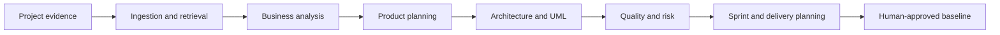

# Axiom — AI Software Engineering Copilot

Axiom is an interactive enterprise dashboard prototype for a governed, multi-agent software engineering platform. It explores how raw project evidence—requirements, PDFs, meeting notes, and client emails—can become traceable engineering artifacts across the software development lifecycle.

[View the live prototype](https://axiom-engineering-copilot.adem9annas.chatgpt.site)

## What Axiom demonstrates

- Document ingestion and retrieval preparation
- Functional and non-functional requirement generation
- Epics, user stories, acceptance criteria, and backlog planning
- Architecture, UML, database, and API design views
- Risk analysis, test planning, and sprint management
- DevOps and production-readiness workflows
- Human approval gates, evidence lineage, and auditability
- Executive, project, risk, and delivery dashboards

## Specialist-agent model

Axiom separates responsibilities across eight specialist roles:

1. Business Analyst
2. Product Owner
3. Software Architect
4. UML Architect
5. QA Engineer
6. Scrum Master
7. Risk Manager
8. DevOps Engineer

Each role is designed around an explicit input contract, output structure, tool boundary, memory scope, and review policy.



## Product principles

- Generated text is a proposal, not automatically a delivery artifact.
- Every approved output should have an owner, version, evidence lineage, and validation result.
- Retrieval authorization must be enforced by the system, not delegated to prompts.
- Human review should be triggered by confidence, conflict, policy, and residual risk.
- Specialist agents need distinct responsibilities and measurable acceptance criteria.

## Current implementation

This repository contains the responsive product experience used to demonstrate Axiom's workflows and architecture. It is a frontend prototype rather than the complete production backend described in the product concept.

Built with:

- React 19 and TypeScript
- Next.js-compatible routing through Vinext
- Vite and Cloudflare tooling
- Tailwind CSS
- Drizzle ORM scaffolding
- Node.js 22+

## Run locally

```bash
npm install
npm run dev
```

Then open the local URL printed by the development server.

## Quality checks

```bash
npm run lint
npm test
```

## Planned production architecture

The full platform design targets Angular 18, FastAPI, PostgreSQL, Redis, LangGraph, CrewAI, Groq, Qdrant, object storage, OpenTelemetry, and a secure RAG pipeline. Those services are represented in the prototype but are not implemented in this repository yet.

## Status

Portfolio prototype and architecture concept. Contributions and feedback are welcome through GitHub Issues.
